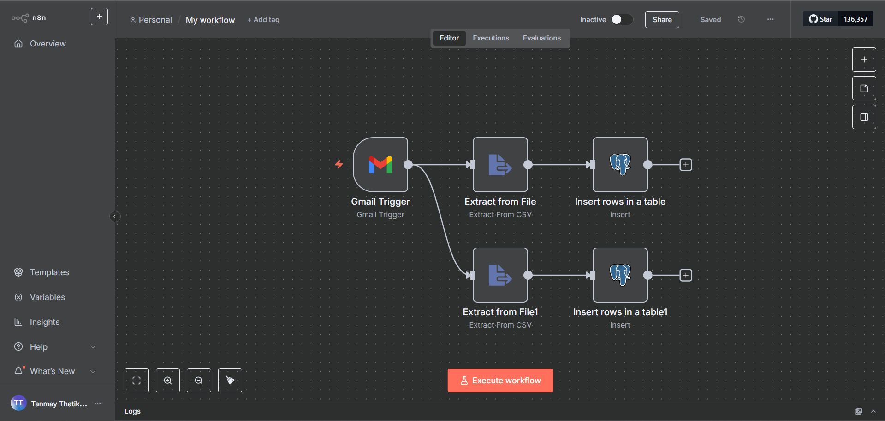
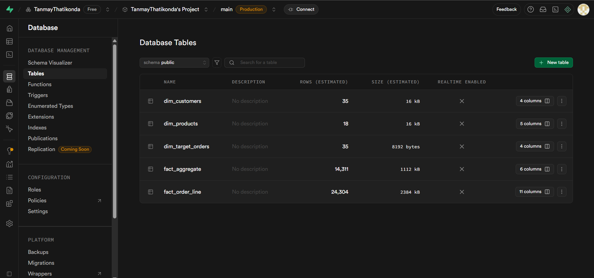
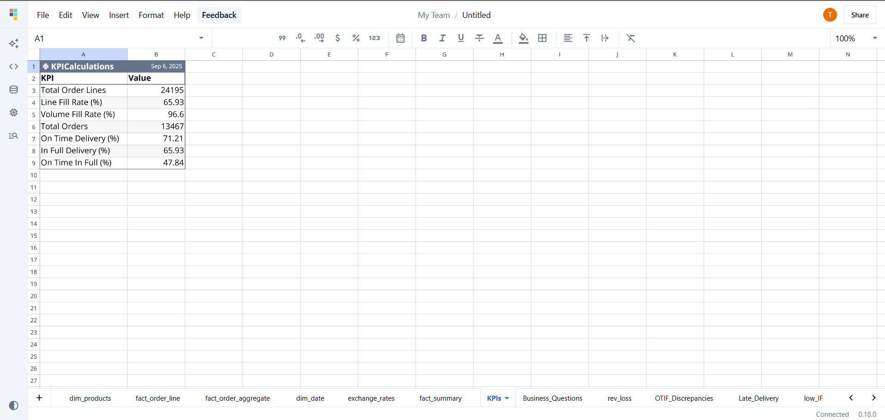

# End-to-End Supply Chain Analytics Project


This project demonstrates a complete, end-to-end analytics solution for monitoring and optimizing supply chain performance for a fictional FMCG company, Atlique Mart. It automates the entire data pipeline, from ingesting raw data received via email to generating actionable business insights using an AI-powered analytics tool. This system empowers proactive decision-making rather than reactive firefighting.

---

### Table of Contents
1.  [Project Overview & Data Flow](#project-overview--data-flow)
2.  [Project Showcase](#project-showcase)
3.  [Business Problem & Impact](#business-problem--impact)
4.  [Technical Architecture](#technical-architecture)
5.  [Repository Structure](#repository-structure)
6.  [Key Supply Chain Metrics](#key-supply-chain-metrics)
7.  [Technology Stack](#technology-stack)
8.  [Setup & Installation](#setup--installation)
9.  [Usage & Analysis](#usage--analysis)
10. [Live Analysis in Quadratic](#live-analysis-in-quadratic)
11. [Key Business Questions Answered](#key-business-questions-answered)
12. [Contributing](#contributing)
13. [Contact](#contact)

---

### Project Overview & Data Flow

The project establishes a seamless flow of information from raw data sources to an interactive analytics dashboard, enabling real-time performance monitoring.

**Gmail (CSV Data) → n8n (ETL Automation) → Supabase/PostgreSQL (Data Warehouse) → Quadratic (AI Analytics & Visualization)**

---

### Project Showcase

#### n8n Workflow Canvas


#### Supabase Database Backend


#### Quadratic KPI Dashboard



---

### Business Problem & Impact

Atlique Mart, a rapidly growing organic food manufacturer, is facing significant operational hurdles due to an outdated and manual supply chain management process.

**The Problem:**
* **Poor Inventory Control:** Frequent stockouts and overstocking lead to lost sales and increased costs.
* **Inadequate Performance Monitoring:** An inability to consistently calculate key KPIs like On-Time In-Full (OTIF) makes it impossible to identify bottlenecks.
* **Reactive Decision-Making:** The analytics team is bogged down by manual data preparation, preventing strategic analysis.

**The Business Impact of this Solution:**
* This dashboard empowers **proactive decision-making**, allowing management to address issues before they impact customers.
* By providing clear visibility into performance gaps, Atlique Mart can make targeted improvements. For example, **improving OTIF by just 5% for a key customer could reduce revenue churn and significantly strengthen the business relationship.**
* The solution transforms the supply chain from a reactive cost center into a proactive, data-driven operation poised for scalable growth.

---

### Technical Architecture

This project implements a modern data stack to create a fully automated analytics pipeline.

1.  **Data Ingestion (Automation):** An **n8n** workflow uses **Gmail API** credentials to automatically monitor an inbox, parse incoming CSV files, and trigger the ETL process.
2.  **Data Warehousing (Storage):** The extracted data is cleaned, structured, and loaded into a **PostgreSQL database** hosted on **Supabase**, creating a single source of truth.
3.  **Data Analysis & Visualization (AI-Powered Analytics):** **Quadratic**, an AI-powered spreadsheet, is connected directly to the Supabase database to perform complex analysis, calculate KPIs, and answer key business questions.

---

### Repository Structure
```
.
├── n8n/
│   └── supply_chain_workflow.json      # Automation workflow JSON for import
├── supabase/
│   └── schema.sql                      # SQL script to create database tables
├── data/
│   └── initial_data_files.csv          # Folder with the raw CSV data
└── README.md                           # Project documentation (this file)
```

---

### Key Supply Chain Metrics

The analysis focuses on tracking industry-standard KPIs to measure fulfillment performance from the customer's perspective.

* **Line Fill Rate (LFR):** The percentage of order lines shipped in full out of the total lines ordered.
* **Volume Fill Rate (VFR):** The percentage of the total quantity shipped versus the total quantity ordered.
* **On-Time Delivery (OTD %):** The percentage of orders delivered by the agreed-upon time.
* **In-Full Delivery (IF %):** The percentage of orders delivered with all items and in the correct quantities.
* **On-Time In-Full (OTIF %):** The percentage of orders that are delivered both on time and in full—the gold standard for order fulfillment.

---

### Technology Stack

* **Automation/ETL:** n8n
* **Database:** PostgreSQL (on Supabase)
* **Analytics:** Quadratic AI
* **API Integration:** Google Cloud Platform (for Gmail API)
* **Runtime Environment:** Node.js

---

### Setup & Installation

To replicate this project, follow these high-level steps:

1.  **Prerequisites:** Ensure you have [Node.js](https://nodejs.org/) installed on your system.
2.  **n8n Setup & Workflow Import:**
    * Install n8n globally via command prompt using `npm install -g n8n`.
    * Launch n8n by typing `n8n` in the command prompt and navigating to `http://localhost:5678`.
    * On the n8n canvas, click on **File > Import from File...** and select the `.json` workflow file from the `/n8n` directory to import the entire workflow.
3.  **Supabase Database Setup:**
    * Create a free account on [Supabase](https://supabase.com).
    * Set up a new project and obtain your database connection credentials.
    * Use the `/supabase/schema.sql` file to create the table structure and then import the initial data from the `/data` directory.
4.  **Google Cloud & Gmail API:**
    * Go to the [Google Cloud Console](https://console.cloud.google.com/).
    * Create a new project, enable the Gmail API, and configure an OAuth 2.0 Consent Screen.
    * Create an OAuth Client ID and Secret, ensuring you add the correct redirect URI for n8n (`http://localhost:5678/rest/oauth2-credential/callback`).
5.  **Connect the Tools:**
    * In your imported n8n workflow, you will need to reconnect the credentials for the **Gmail** and **PostgreSQL** nodes. Click on each node, select "Create New" from the credentials dropdown, and enter the details from your Supabase and Google Cloud setup.
    * In Quadratic, establish a connection to your Supabase database.

---

### Usage & Analysis

Once the setup is complete, the project can be used as follows:

1.  **Execute the n8n Workflow:** Run the workflow to fetch new data from Gmail and load it into the PostgreSQL database.
2.  **Perform Analysis in Quadratic:** Open the connected Quadratic spreadsheet.
3.  **Use AI Prompts:**  Write and execute prompts in Quadratic to:
    * Create dynamic date and exchange rate tables.
    * Clean, merge, and summarize data into a master `fact_summary` table.
    * Calculate all the key business KPIs.
    * Generate insights on top-performing and under-performing customers and products.

---

### Live Analysis in Quadratic

You can view the final, interactive analysis and visualizations for this project in the live Quadratic spreadsheet.

**➡️ [View the Live Project Here](https://app.quadratichq.com/file/ce04cc41-2fef-4d76-8c4f-f381ce7dbfef)**

---

### Key Business Questions Answered

This project provides the tools and data to answer the following critical business questions:

* Quantify the revenue loss attributed to undelivered orders.
* Identify customers with the most significant On-Time, In-Full (OTIF) discrepancies.
* Determine product categories that exhibit low 'In-Full' delivery rates.
* Calculate the average delay time for late deliveries.
* Identify potential supply chain bottlenecks based on fulfillment data.

---

### Contributing
Contributions, issues, and feature requests are welcome! Feel free to check the issues page. You can also fork the repo and create a pull request.

---

### Contact

- **Name:** Tanmay Thatikonda
- **LinkedIn:** www.linkedin.com/in/tanmay-thatikonda-199a7a22b
- **Email:** tanmaythatikonda@gmail.com
